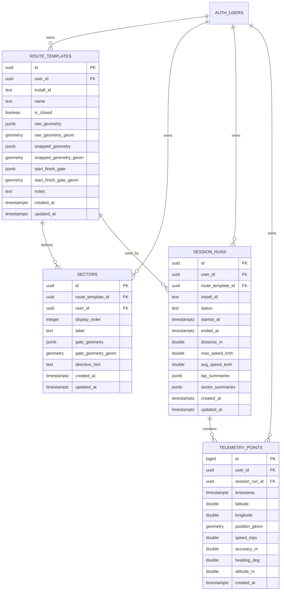
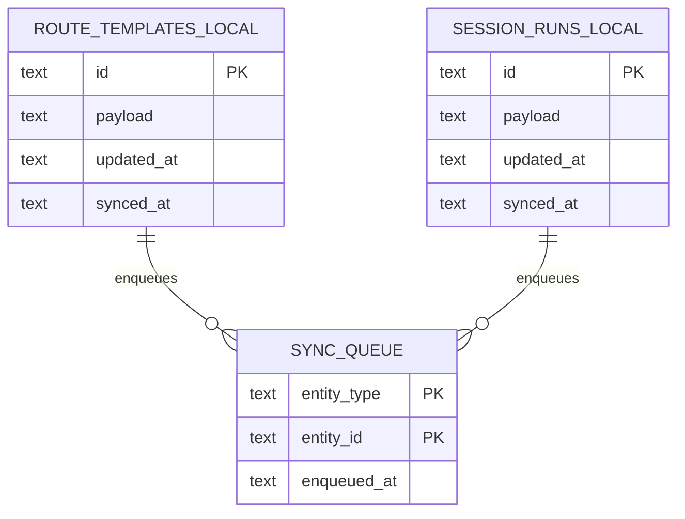

# Database Schema

Este documento explica las tablas SQL del proyecto, cómo se relacionan entre sí y en qué momento se usa cada una.

La persistencia está dividida en dos capas:

- Supabase/Postgres: almacenamiento remoto y relacional del backend.
- SQLite local en móvil: almacenamiento offline y cola de sincronización.

## Visión general

El flujo general es este:

1. El usuario crea una ruta.
2. La app guarda esa ruta localmente.
3. Cuando hay conectividad, la sincroniza a Supabase.
4. El usuario inicia una sesión sobre esa ruta.
5. La app guarda la sesión y su telemetría localmente.
6. Más tarde sincroniza la sesión y sus puntos GPS a Supabase.

## Diagrama ER de Supabase



## Diagrama de persistencia local



## Tablas remotas de Supabase

### `route_templates`

Representa una ruta o circuito definido por el usuario.

Se usa cuando el usuario:

- dibuja una ruta
- ajusta la geometría con Mapbox
- define si la ruta es cerrada o abierta
- establece la línea de salida/meta

Columnas importantes:

- `raw_geometry`: trazado original dibujado por el usuario en GeoJSON.
- `snapped_geometry`: trazado ajustado o enriquecido, también en GeoJSON.
- `start_finish_gate`: línea que marca salida/meta.
- `is_closed`: indica si la ruta genera vueltas o solo sectores.

Cada fila de `route_templates` puede tener:

- muchos `sectors`
- muchas `session_runs`

### `sectors`

Representa las divisiones internas de una `route_template`.

Se usa cuando una ruta necesita puertas intermedias para detectar sectores.

Columnas importantes:

- `route_template_id`: enlaza el sector con su ruta.
- `display_order`: orden del sector dentro de la ruta.
- `gate_geometry`: línea de cruce del sector.
- `direction_hint`: ayuda a interpretar el sentido de cruce.

Una ruta puede no tener sectores, o tener varios.

### `session_runs`

Representa una sesión real ejecutada sobre una ruta.

Se usa cuando el usuario:

- inicia una tanda o recorrido
- registra una sesión completa
- necesita guardar métricas agregadas

Columnas importantes:

- `route_template_id`: ruta sobre la que se hizo la sesión.
- `status`: estado de la sesión. Los valores permitidos son `draft`, `recording`, `completed` y `synced`.
- `distance_m`, `max_speed_kmh`, `avg_speed_kmh`: resumen numérico de la sesión.
- `lap_summaries`: resumen de vueltas ya calculadas.
- `sector_summaries`: resumen de sectores ya calculados.

`session_runs` no guarda la telemetría completa dentro del mismo registro. Esa parte vive en `telemetry_points`.

### `telemetry_points`

Representa la telemetría cruda de una sesión.

Se usa para guardar el detalle temporal punto a punto:

- posición GPS
- velocidad
- precisión
- rumbo
- altitud

Columnas importantes:

- `session_run_id`: sesión a la que pertenece el punto.
- `timestamp`: momento exacto de la muestra.
- `latitude`, `longitude`: coordenadas geográficas.
- `speed_mps`: velocidad medida por el dispositivo.
- `position_geom`: versión PostGIS del punto.

Una `session_run` suele tener muchos `telemetry_points`.

## Relación entre las tablas remotas

La estructura conceptual es:

- un usuario tiene muchas rutas
- una ruta tiene muchos sectores
- una ruta tiene muchas sesiones
- una sesión tiene muchos puntos de telemetría

En forma lineal:

```text
auth.users
  -> route_templates
     -> sectors
     -> session_runs
        -> telemetry_points
```

## Por qué hay `jsonb` y `geometry` a la vez

Las tablas remotas guardan la información espacial de dos formas:

- `jsonb`: para conservar la estructura original que la app maneja bien, por ejemplo GeoJSON o listas serializadas.
- `geometry`: para consultas espaciales rápidas con PostGIS.

Ejemplos:

- `raw_geometry` y `raw_geometry_geom`
- `snapped_geometry` y `snapped_geometry_geom`
- `start_finish_gate` y `start_finish_gate_geom`
- `gate_geometry` y `gate_geometry_geom`

Esto permite tener compatibilidad con la app y, a la vez, capacidad de búsqueda y análisis geoespacial en base de datos.

## Triggers y funciones automáticas

La migración define funciones y triggers para evitar que la app tenga que mantenerlo todo manualmente.

### Conversión automática de geometrías

Cuando se inserta o actualiza una fila:

- `route_templates` convierte sus GeoJSON a columnas `geometry`
- `sectors` convierte `gate_geometry` a `gate_geometry_geom`
- `telemetry_points` convierte `latitude` y `longitude` en `position_geom`

Esto se hace con:

- `geojson_to_linestring`
- `telemetry_to_point`
- `sync_route_template_geometries`
- `sync_sector_geometries`
- `sync_telemetry_geometries`

### Actualización automática de `updated_at`

Las tablas `route_templates`, `sectors` y `session_runs` tienen un trigger que actualiza `updated_at` en cada `UPDATE`.

## Seguridad: Row Level Security

Las cuatro tablas remotas tienen RLS activado.

La policy aplicada es de propietario:

- solo puedes leer tus filas
- solo puedes modificar tus filas
- solo puedes insertar filas con tu propio `user_id`

Eso se controla comparando `auth.uid()` con `user_id`.

## Índices

Se crean índices para dos tipos de acceso:

- por propietario y fecha, por ejemplo en `route_templates` y `session_runs`
- por geometría con índices GiST para consultas espaciales

Ejemplos:

- `route_templates_user_idx`
- `session_runs_user_idx`
- `telemetry_points_session_idx`
- índices GiST sobre `*_geom`

## Persistencia local en SQLite

La base local no intenta reproducir todo el modelo relacional remoto.

En lugar de eso, guarda objetos completos serializados en JSON.

### `route_templates` local

Guarda la ruta entera en `payload`.

Se usa para:

- trabajar offline
- reabrir rutas sin pedirlas al backend
- encolar cambios pendientes de sincronización

### `session_runs` local

Guarda la sesión completa en `payload`, incluida la telemetría.

Se usa para:

- grabar sesiones sin depender de red
- preservar sesiones aunque falle la conectividad
- sincronizarlas después

### `sync_queue`

Guarda qué entidades están pendientes de subir.

Cada fila indica:

- `entity_type`: `route_template` o `session_run`
- `entity_id`: id de la entidad
- `enqueued_at`: cuándo se marcó como pendiente

## Flujo real de sincronización

La app sigue esta secuencia:

1. Guarda una ruta o una sesión en SQLite.
2. Añade la entidad a `sync_queue`.
3. Cuando hay conectividad y Supabase está disponible, recorre la cola.
4. Si el item es `route_template`, hace `upsert` en `route_templates`.
5. Después borra los `sectors` anteriores de esa ruta y los vuelve a insertar completos.
6. Si el item es `session_run`, hace `upsert` en `session_runs`.
7. Después borra los `telemetry_points` anteriores de esa sesión y los vuelve a insertar completos.
8. Si todo sale bien, marca la entidad como sincronizada en SQLite.

Ese detalle importa:

- `route_templates` y `session_runs` se sincronizan con `upsert`
- `sectors` y `telemetry_points` se reconstruyen por completo en cada sincronización

## Ejemplo completo

Supón que el usuario crea la ruta `Karting Indoor`.

### Paso 1: plantilla de ruta

Se crea un `route_template`:

- `id = rt_1`
- `name = "Karting Indoor"`
- `is_closed = true`
- `raw_geometry =` trazado dibujado
- `start_finish_gate =` línea de meta

### Paso 2: sectores de la ruta

Se crean varios `sectors` asociados a `rt_1`:

- sector 1
- sector 2
- sector 3

Todos con `route_template_id = rt_1`.

### Paso 3: sesión real

Cuando el usuario conduce, se crea una `session_run`:

- `id = run_1`
- `route_template_id = rt_1`
- `status = completed`
- `distance_m = 2150`
- `avg_speed_kmh = 46`
- `max_speed_kmh = 71`

Además:

- `lap_summaries` guarda las vueltas calculadas
- `sector_summaries` guarda los tiempos de sector calculados

### Paso 4: telemetría cruda

Durante la sesión se generan muchos `telemetry_points`:

- punto 1
- punto 2
- punto 3
- ...

Todos con `session_run_id = run_1`.

## Resumen rápido

Si lo reduces a una idea por tabla:

- `route_templates`: la definición de una ruta
- `sectors`: las puertas intermedias de esa ruta
- `session_runs`: una ejecución real sobre esa ruta
- `telemetry_points`: la señal GPS cruda de esa ejecución
- `route_templates` local: caché offline de rutas
- `session_runs` local: caché offline de sesiones
- `sync_queue`: cola de sincronización pendiente

## Referencias de implementación

- Migración SQL remota: [20260410_initial_schema.sql](../supabase/migrations/20260410_initial_schema.sql)
- Persistencia local SQLite: [carnometer_local_database.dart](../apps/mobile/lib/src/data/local/carnometer_local_database.dart)
- Sincronización con Supabase: [supabase_sync_service.dart](../apps/mobile/lib/src/data/repositories/supabase_sync_service.dart)
- Arquitectura general: [architecture-poc.md](./architecture-poc.md)
